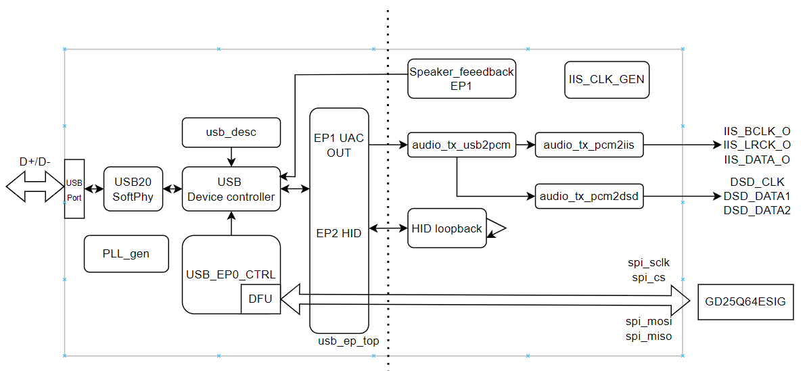

# Gowin USB 2.0 Composite Device Reference Design — UAC HIFI + HID + DFU

> **语言**: [中文](#中文) | [English](#english)

---

<a id="中文"></a>
## 中文

### 1. 项目简介

本项目基于 **高云 GW5A-25 (Arora V)** FPGA，实现了一款 USB 2.0 High-Speed 复合设备参考设计。设备同时集成了三个核心功能模块：

| 功能 | 说明 |
|---|---|
| **UAC 2.0 HIFI 音频播放** | 异步反馈模式，支持 44.1kHz~768kHz 采样率、16/24/32-bit 位深，可输出 PCM / IIS / DSD / DoP 音频流 |
| **HID 双向通信** | 基于中断传输端点，当前固件内置回环测试，可按需二次定制 |
| **DFU 后台固件升级** | 基于 USB DFU 标准协议，底层采用 Multi-Boot 架构防砖，可在线升级工作固件而不影响 Golden Image |

**适用开发板**: DK_START_GW5A-LV25UG324_V2.0

### 2. 功能特性

- **USB 2.0 High-Speed (480Mbps)**，FPGA 软核实现 USB PHY + Device Controller
- **异步反馈 (Asynchronous Feedback)** 机制，精确匹配主机发送速率与本地音频时钟
- **IIS 输出**: BCLK / LRCK / DATA，兼容标准音频 DAC
- **DSD 原生输出**: 支持 DSD64/128/256 以及 DoP (DSD over PCM) 封装格式
- **HID 回环测试**: Out → In 数据透明转发，可验证传输链路
- **DFU 在线升级**: 上位机通过 USB 更新 SPI Flash 中的工作固件
- **Multi-Boot 安全架构**: Golden Image (备份) + Working Image (可升级) 分区隔离，升级失败自动回退
- **高度参数化设计**: 通道数、采样率、工作模式均可通过宏定义/parameter 配置

### 3. 系统框图

```
┌──────────────────────────────────────────────────────────────────────┐
│                          FPGA (GW5A-25)                               │
│                                                                       │
│  ┌──────────┐   ┌─────────────┐   ┌──────────────────────────────┐  │
│  │  USB     │   │  USB Device │   │                              │  │
│  │  SoftPHY │◄──┤  Controller │   │   UAC HIFI Audio Subsystem   │  │
│  │  (UTMI)  │   │  + EP Ctrl  │──►├──────────────────────────────┤  │
│  └──────────┘   └──────┬──────┘   │  USB→PCM → IIS/DSD → DAC pins │  │
│                        │          │  + Async Feedback (EP81)       │  │
│                        │          └──────────────────────────────┘  │
│                        │                                             │
│                        ├──────────►  HID Loopback (EP2 Out→In)      │
│                        │                                             │
│                        └──────────►  DFU → SPI Flash Controller     │
│                                                                       │
│  ┌──────────────────────────────────────────────────────────────┐   │
│  │  Clock & Reset: PLL(USB/Audio/Gen) + DCS Dynamic Switch      │   │
│  └──────────────────────────────────────────────────────────────┘   │
└──────────────────────────────────────────────────────────────────────┘
```



### 4. 工作模式

| 宏定义 | 模式 | 说明 |
|---|---|---|
| `HIFI_ONLY` | 纯音频模式 | 仅 UAC 音频播放，无 HID/DFU |
| `HIFI_HID_DFU` (默认) | 全功能模式 | 同时使能音频 + HID + DFU |

### 5. 硬件需求

| 项目 | 规格 / 型号 |
|---|---|
| FPGA 开发板 | DK_START_GW5A-LV25UG324_V2.0 |
| FPGA 芯片 | GW5A-25 (Arora V) |
| 外部 SPI Flash | 8MB 及以上（用于 DFU Multi-Boot） |
| 音频 DAC | 支持 IIS 或 DSD 输入的外置 DAC（如 ES9038 / PCM5102 等） |
| USB 连接线 | USB 2.0 High-Speed 数据线 |

### 6. 软件 / 工具需求

| 工具 | 版本 / 说明 | 用途 |
|---|---|---|
| Gowin EDA (IDE) | V1.9.12.03 及以上 | 综合、布局布线、生成位流 |
| Gowin Programmer | 随 IDE 附带 | 烧录位流到 FPGA / Flash |
| [Zadig](https://zadig.akeo.ie/) | 最新版 | Windows 下替换 USB 驱动为 WinUSB |
| dfu-util | 已提供于 `tools/` | DFU 固件升级命令行工具 |

### 7. 快速开始

#### 7.1 硬件准备

1. 将开发板 USB 接口连接到 PC
2. 将 IIS/DSD 引脚连接到外部音频 DAC（参考 [外部硬件接口说明](./docs/UAC_HID_DFU_Doc_V1.0_CN.html#2-外部硬件接口说明)）
3. 确保跳线帽配置正确（供电、JTAG 等）

#### 7.2 打开工程

1. 启动 Gowin EDA IDE
2. 打开工程文件：`prj/GW5A25_UAC_HIFI+HID+DFU_V1.0/src/usb_refdesign.rao`
3. 确认器件型号为 GW5A-25，封装 LV25UG324

#### 7.3 配置工作模式

编辑 `src/include/audio_define.vh`，根据需求使能对应宏：

```verilog
// 选择工作模式
// `define HIFI_ONLY
`define HIFI_HID_DFU        // 默认：全功能模式

// 选择通道数
`define MODE_2CN
`define CHANNEL_NUM 2
```

#### 7.4 综合 & 下载

1. 在 IDE 中执行 **Synthesize** → **Place & Route** → **Generate Bitstream**
2. 使用 Gowin Programmer 将位流下载到 FPGA SRAM（快速验证）或烧录到 SPI Flash（持久化）

#### 7.5 功能验证

各功能详细验证步骤请参考 [HTML 技术文档](./docs/UAC_HID_DFU_Doc_V1.0_CN.html)：

| 章节 | 内容 |
|---|---|
| 第 5 章 | UAC HIFI 音频播放测试（驱动安装 → 音频播放 → IIS/DSD 信号测量） |
| 第 6 章 | HID 回环测试（ZC6200 工具收发验证） |
| 第 7 章 | DFU 后台升级测试（Multi-Boot 预设 → dfu-util 升级 → 复位验证） |

### 8. 工程目录结构

```
GowinUACGit/
├── README.md                             # 本文件：项目概览与快速上手
├── docs/                                 # 详细文档
│   ├── picture/                          #   文档插图（系统框图、测试截图等）
│   ├── UAC_HID_DFU_Doc_V1.0_CN.html     #   中文技术参考手册 (HTML)
│   ├── UAC_HID_DFU_Doc_V1.0_EN.html     #   英文技术参考手册 (HTML)
│   ├── UAC_HIFI+HID+DFU_用户指导手册.pdf  #   中文用户指导手册 (PDF)
│   └── UAC_HIFI+HID+DFU_User Guide.pdf   #   英文用户指导手册 (PDF)
├── prj/                                  # FPGA 工程
│   └── GW5A25_UAC_HIFI+HID+DFU_V1.0/
│       ├── src/
│       │   ├── rtl/                      #   RTL 源码 (SystemVerilog)
│       │   │   ├── TOP.sv                #     顶层模块
│       │   │   ├── USB_EP0_ctrl.sv       #     EP0 类请求解析
│       │   │   ├── uac/                  #     UAC 音频子系统
│       │   │   ├── usb_endpoint/         #     USB 端点管理 & 缓冲区
│       │   │   ├── usb_des/              #     USB 描述符 ROM
│       │   │   └── spi_flash_controller/ #     SPI Flash 控制器 (DFU)
│       │   ├── ip/                       #   Gowin IP 核 (PLL/PHY/Controller)
│       │   ├── include/                  #   全局宏定义 & 接口定义
│       │   └── constrs/                  #   物理约束 & 时序约束
│       └── impl/                         # 综合 / PnR 生成产物 (已 gitignore)
└── tools/                                # 测试工具
    ├── dfu-util.exe                      #   DFU 命令行工具
    ├── libusb-1.0.dll                    #   USB 驱动库
    └── DFU_bin/                          #   预编译固件
        ├── 5A25_HIFI+HID+DFU_V1.0.bin   #     全功能固件 (2CH)
        ├── 5A25_HIFIonly_V1.0.bin       #     纯音频固件
        ├── mode_2CN_V1.4.0.bin          #     2通道 DFU 固件
        └── mode_8CN_V1.4.0.bin          #     8通道 DFU 固件
```

### 9. ⚠️ 硬件设计重要提示

#### 9.1 音频时钟精度

DK_START_GW5A-LV25UG324_V2.0 开发板**未配备 44.1kHz 采样率基准的音频专用晶振**（如 45.1842MHz）。当前工程中 `IIS_CLK_45158` 由 `Gowin_PLL_iis` 生成，存在一定的精度误差。

**建议**: 在设计新硬件时，增加专用的 44.1kHz / 48kHz 音频晶振，并将顶层文件 `Top.sv` 中的 `IIS_CLK_49152` / `IIS_CLK_45158` 替换为外部硬件时钟输入。

#### 9.2 USB 信号完整性

当前开发板采用**单差分 USB IO**（`USB_DXP_IO`）设计。实测表明，采用**双差分 USB IO**（USB SoftPHY IP 选择 "Dual LVDS_Mode"，将输入输出分离为 `USB_DXP_I` 和 `USB_DXP_O`），在兼容多种设备时能提供更优的信号完整性。

详细设计参考：[Gowin USB 2.0 SoftPHY 器件外围电路设计指南](https://www.gowinsemi.com.cn/ip/151)

### 10. 参考文档

| 文档 | 说明 |
|---|---|
| [USB 复合设备系统架构说明 (HTML)](./docs/UAC_HID_DFU_Doc_V1.0_CN.html) | 完整技术参考：架构、参数配置、功能测试 |
| [USB Composite Device System Architecture (HTML)](./docs/UAC_HID_DFU_Doc_V1.0_EN.html) | Full Technical Reference (EN) |
| [用户指导手册 (PDF)](./docs/UAC_HIFI+HID+DFU_用户指导手册.pdf) | 工程框架说明与测试指导 |
| [Gowin USB 2.0 SoftPHY IP 用户指南](https://www.gowinsemi.com.cn/ip/151) | USB PHY IP 配置与外围电路设计 |
| [Gowin USB 2.0 Device Controller IP 用户指南](https://www.gowinsemi.com.cn) | USB Device Controller IP 接口与协议说明 |

---

<a id="english"></a>
## English

### 1. Introduction

This project implements a **USB 2.0 High-Speed composite device** reference design based on the **Gowin GW5A-25 (Arora V)** FPGA. The device integrates three core functional modules:

| Function | Description |
|---|---|
| **UAC 2.0 HIFI Audio Playback** | Asynchronous feedback mode; supports 44.1kHz–768kHz sample rates, 16/24/32-bit depth; outputs PCM / IIS / DSD / DoP streams |
| **HID Bidirectional Communication** | Interrupt transfer endpoints with built-in loopback test; customizable for user applications |
| **DFU Background Firmware Upgrade** | USB DFU standard protocol; Multi-Boot architecture (Golden + Working Image) for brick-proof online updates |

**Target Board**: DK_START_GW5A-LV25UG324_V2.0

### 2. Features

- **USB 2.0 High-Speed (480Mbps)** with FPGA soft-core USB PHY + Device Controller
- **Asynchronous Feedback** mechanism for precise host-to-local audio clock synchronization
- **IIS Output**: BCLK / LRCK / DATA, compatible with standard audio DACs
- **Native DSD Output**: Supports DSD64/128/256 and DoP (DSD over PCM) encapsulation
- **HID Loopback Test**: Out → In transparent data forwarding for link verification
- **DFU Online Upgrade**: Host updates SPI Flash firmware via USB
- **Multi-Boot Safety**: Golden Image (backup) + Working Image (upgradable) partition isolation; auto fallback on upgrade failure
- **Highly Parameterized**: Channel count, sample rate, and working mode configurable via macros/parameters

### 3. Block Diagram

```
┌──────────────────────────────────────────────────────────────────────┐
│                          FPGA (GW5A-25)                               │
│                                                                       │
│  ┌──────────┐   ┌─────────────┐   ┌──────────────────────────────┐  │
│  │  USB     │   │  USB Device │   │                              │  │
│  │  SoftPHY │◄──┤  Controller │   │   UAC HIFI Audio Subsystem   │  │
│  │  (UTMI)  │   │  + EP Ctrl  │──►├──────────────────────────────┤  │
│  └──────────┘   └──────┬──────┘   │  USB→PCM → IIS/DSD → DAC pins │  │
│                        │          │  + Async Feedback (EP81)       │  │
│                        │          └──────────────────────────────┘  │
│                        │                                             │
│                        ├──────────►  HID Loopback (EP2 Out→In)      │
│                        │                                             │
│                        └──────────►  DFU → SPI Flash Controller     │
│                                                                       │
│  ┌──────────────────────────────────────────────────────────────┐   │
│  │  Clock & Reset: PLL(USB/Audio/Gen) + DCS Dynamic Switch      │   │
│  └──────────────────────────────────────────────────────────────┘   │
└──────────────────────────────────────────────────────────────────────┘
```


### 4. Working Modes

| Macro | Mode | Description |
|---|---|---|
| `HIFI_ONLY` | Audio-only | UAC audio playback only, no HID/DFU |
| `HIFI_HID_DFU` (default) | Full-featured | Audio + HID + DFU enabled |

Channel configuration (`audio_define.vh`):

| Macro | Channels | Description |
|---|---|---|
| `MODE_2CN` (default) | 2-channel | DSD version only supports 2CH |
| `MODE_8CN` | 8-channel | IIS mode only |

### 5. Hardware Requirements

| Item | Specification / Model |
|---|---|
| FPGA Board | DK_START_GW5A-LV25UG324_V2.0 |
| FPGA Device | GW5A-25 (Arora V) |
| External SPI Flash | 8MB+ (for DFU Multi-Boot) |
| Audio DAC | External DAC with IIS or DSD input (e.g., ES9038, PCM5102) |
| USB Cable | USB 2.0 High-Speed cable |

### 6. Software / Tool Requirements

| Tool | Version / Notes | Purpose |
|---|---|---|
| Gowin EDA (IDE) | V1.9.12.03 or later | Synthesis, PnR, bitstream generation |
| Gowin Programmer | Bundled with IDE | Program bitstream to FPGA / Flash |
| [Zadig](https://zadig.akeo.ie/) | Latest | Replace USB driver with WinUSB on Windows |
| dfu-util | Provided in `tools/` | DFU firmware upgrade CLI tool |

### 7. Quick Start

#### 7.1 Hardware Setup

1. Connect the development board USB port to your PC
2. Connect IIS/DSD pins to an external audio DAC (see [External Hardware Interface Description](./docs/UAC_HID_DFU_Doc_V1.0_EN.html#2-external-hardware-interface-description))
3. Verify jumper settings (power, JTAG, etc.)

#### 7.2 Open Project

1. Launch Gowin EDA IDE
2. Open project file: `prj/GW5A25_UAC_HIFI+HID+DFU_V1.0/src/usb_refdesign.rao`
3. Verify device is GW5A-25, package LV25UG324

#### 7.3 Configure Working Mode

Edit `src/include/audio_define.vh` and enable the desired macros:

```verilog
// Select working mode
// `define HIFI_ONLY
`define HIFI_HID_DFU        // Default: full-featured mode

// Select channel count
`define MODE_2CN
`define CHANNEL_NUM 2
```

#### 7.4 Synthesize & Download

1. In the IDE, run **Synthesize** → **Place & Route** → **Generate Bitstream**
2. Use Gowin Programmer to download the bitstream to FPGA SRAM (quick test) or program to SPI Flash (persistent)

#### 7.5 Functional Verification

For detailed verification steps, refer to the [HTML Technical Reference](./docs/UAC_HID_DFU_Doc_V1.0_EN.html):

| Chapter | Content |
|---|---|
| Ch. 5 | UAC HIFI Audio Playback Test (driver install → playback → IIS/DSD signal measurement) |
| Ch. 6 | HID Loopback Test (ZC6200 tool transmit/receive verification) |
| Ch. 7 | DFU Background Upgrade Test (Multi-Boot setup → dfu-util upgrade → reset verification) |

### 8. Project Directory Structure

```
GowinUACGit/
├── README.md                             # This file: overview & quick start
├── docs/                                 # Detailed documentation
│   ├── picture/                          #   Documentation images (diagrams, test screenshots)
│   ├── UAC_HID_DFU_Doc_V1.0_CN.html     #   Technical Reference Manual (Chinese)
│   ├── UAC_HID_DFU_Doc_V1.0_EN.html     #   Technical Reference Manual (English)
│   ├── UAC_HIFI+HID+DFU_用户指导手册.pdf  #   User Guide (Chinese PDF)
│   └── UAC_HIFI+HID+DFU_User Guide.pdf   #   User Guide (English PDF)
├── prj/                                  # FPGA project
│   └── GW5A25_UAC_HIFI+HID+DFU_V1.0/
│       ├── src/
│       │   ├── rtl/                      #   RTL source (SystemVerilog)
│       │   │   ├── TOP.sv                #     Top-level module
│       │   │   ├── USB_EP0_ctrl.sv       #     EP0 class-specific request parser
│       │   │   ├── uac/                  #     UAC audio subsystem
│       │   │   ├── usb_endpoint/         #     USB endpoint manager & buffers
│       │   │   ├── usb_des/              #     USB descriptor ROM
│       │   │   └── spi_flash_controller/ #     SPI Flash controller (DFU)
│       │   ├── ip/                       #   Gowin IP cores (PLL/PHY/Controller)
│       │   ├── include/                  #   Global macros & interface definitions
│       │   └── constrs/                  #   Physical & timing constraints
│       └── impl/                         # Synthesis / PnR artifacts (gitignored)
└── tools/                                # Test utilities
    ├── dfu-util.exe                      #   DFU CLI tool
    ├── libusb-1.0.dll                    #   USB driver library
    └── DFU_bin/                          #   Prebuilt firmware binaries
        ├── 5A25_HIFI+HID+DFU_V1.0.bin   #     Full-featured (2CH)
        ├── 5A25_HIFIonly_V1.0.bin       #     Audio-only
        ├── mode_2CN_V1.4.0.bin          #     2-channel DFU firmware
        └── mode_8CN_V1.4.0.bin          #     8-channel DFU firmware
```

### 9. ⚠️ Important Hardware Design Notes

#### 9.1 Audio Clock Accuracy

The DK_START_GW5A-LV25UG324_V2.0 development board **does not include a dedicated audio crystal oscillator for the 44.1kHz sample rate family** (e.g., 45.1842MHz). The current `IIS_CLK_45158` is generated by `Gowin_PLL_iis`, which has inherent accuracy error.

**Recommendation**: When designing new hardware, add dedicated 44.1kHz / 48kHz audio crystal oscillators and replace `IIS_CLK_49152` / `IIS_CLK_45158` in `Top.sv` with external hardware clock inputs.

#### 9.2 USB Signal Integrity

The current development board uses a **single differential USB IO** (`USB_DXP_IO`) design. Testing has shown that a **dual differential USB IO** design (USB SoftPHY IP set to "Dual LVDS_Mode", separating input/output into `USB_DXP_I` and `USB_DXP_O`) provides superior signal integrity when connecting to various device types.

For detailed guidance, see: [Gowin USB 2.0 SoftPHY Device Peripheral Circuit Design Guide](https://www.gowinsemi.com/en/support/ip_detail/98/)

### 10. References

| Document | Description |
|---|---|
| [USB Composite Device System Architecture (HTML)](./docs/UAC_HID_DFU_Doc_V1.0_EN.html) | Full technical reference: architecture, parameters, functional testing |
| [USB 复合设备系统架构说明 (HTML)](./docs/UAC_HID_DFU_Doc_V1.0_CN.html) | 完整技术参考（中文） |
| [User Guide (PDF)](./docs/UAC_HIFI+HID+DFU_User Guide.pdf) | Framework description & test guide (EN) |
| [Gowin USB 2.0 SoftPHY IP User Guide](https://www.gowinsemi.com/en/support/ip_detail/98/) | USB PHY IP configuration & peripheral circuit design |
| [Gowin USB 2.0 Device Controller IP User Guide](https://www.gowinsemi.com) | Device Controller IP interface & protocol reference |

---

> *Version: V1.0 | Date: 2026-07-27 | Device: GW5A-25 | Board: DK_START_GW5A-LV25UG324_V2.0*
